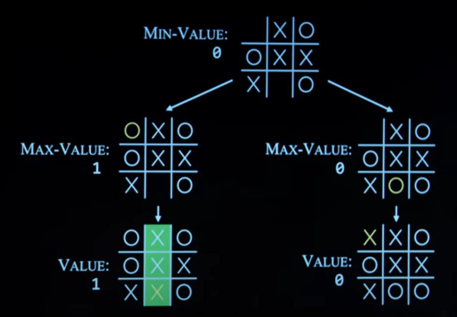
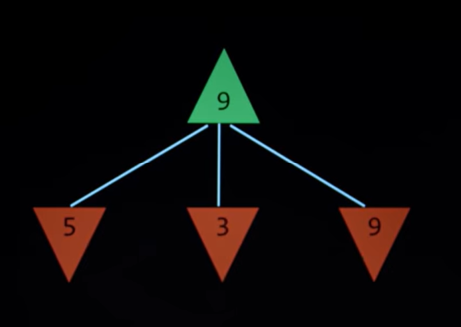
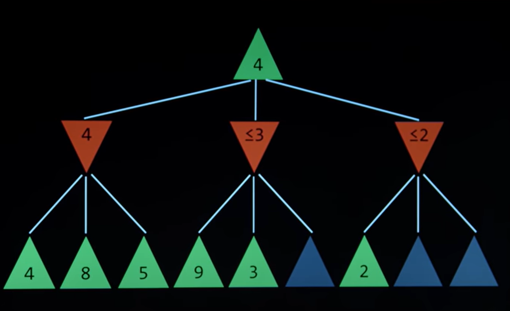

# Search

## Agent
Entity that perceives environment and acts upon that environment

## State
A configuration of the agent and its environment

## Initial State

## Action
Choices that can be make between states
actions 
Actions(s) returns the set of actions that can be executed on state s

## transition model
A description of what state results from performing any appilcalbe ation in any state

Results(s,a) returns the state resulting from performing action 

Results(current state, one action) ==> next State

## state space
the set of all states reachable from the initial state by any sequences of actions

Using graph to represent

## goal test
way to determine whether a given state is a goal state

## path cost
numerical cost associated with a given path

## optimal solution
a solution that has the lowest path cost among all solution

## node
a data structure that keeps track of
- a state
- a parent (node that generate this node)
- an action (action applied to parent to get node)
- a path cose (from initial state to node)

## Approach
1. Start with a frontier that contains the initial state
2. Start with an empty explored set.
2. Repeat:
    1. if the frontier is empty, then no solution
    2. Remove a node from the frontier.
    3. if node contains goal state, return the solution
    4. Add the node to the explroed set
    4. Expand node, add resulting nodes to the frontier if they are not already in the frontier or the explored set

How to remove a node? (in which order)

Stack (LIFO): (DFS  Depth First Search)
- last in first out data type

Queue (FIFO) : (Breadth-first Search)
- first in first out data type

DFS ,not optimal solution
BFS, (need to explore a lot of states, but shortest path)

class Node():
    def __int__(self,state,parent)

class StackFrontier():

## uninformed search
search strategy that uses no problem specific knowledge

## informed search
search strategy that uses problem specific knowledge to find solutions more efficiently

## greedy best search
expands the node that is closest to the goal, as estimated by a heuristic function h(n)

may not find the best solution(it's local decision, but only in that point, not global)

## A* Search
Search Algorithm tht expands node with value of g(n) + h(n)
g(n) = cost to reach node
h(n) = estimated cost to goal

A* Search is optimal if
- h(n) is admissible (never overestimate the true cost) and
- h(n) is consistent (for every node n and successor n' with step cost c,h   h(n)<=h(n') + c )


# Adversarial Search

## minimax

-1, 0 , 1 

O win (-1)
no win (0)
X win (1)

MAX(X) aims to maximize the score
MIN(O) aims to minimize the score

___S___<sub>0</sub>: Initial State

__Player(_s_)__: returns which player to move in state _s_

__Actions(_s_)__: returns legal moves in state _s_

__Result(_s_,_a_)__: returns state after ation _a_ taken in state _s_

__Terminal(_s_)__: chech whether _s_ is a terminal state

__Utility(_s_)__: final numerical value for terminal statue _s_   (-1 or 0 or 1 )





Green Max (pick the max value in it's deceendant)
Red  Min


1. Given a state _s_ :
    1. __MAX__ picks action _a_  in __ACTIONS(_s_)__ that produces highest value of __MIN-VALUE(RESULT(_s_,_a_))__
    2. __MIN__ picks action _a_ in __ACTIONS(_s_)__ that products lowest value of __MAX-VALUE(RESULT(_s_,_a_))__

```python
def MAX-VALUE(s):
    if Terminal(s):
        return Utility(s)
    v = -infite
    for a in Actions(s):
        v= max(v,MIN-VALUE(Result(s,a)))
    return v

def MIN-VALUE(s):
    if Terminal(s):
        return Utility(s)
    v = +infite
    for a in Actions(s):
        v = min(v,MAX-VALUE(Result(s,a)))
    return v
    
```

## Alpha Beta Pruning



## Depth - Limited MiniMax